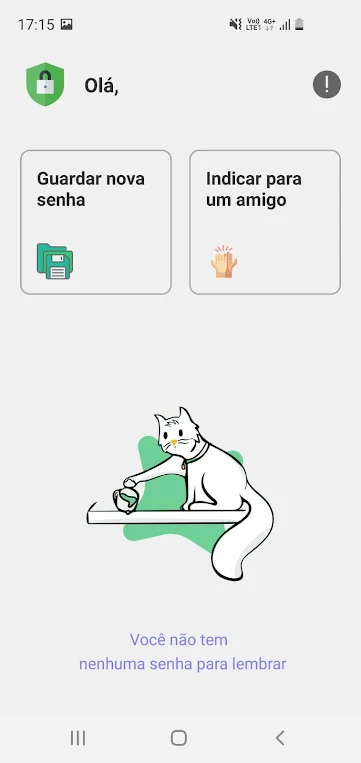
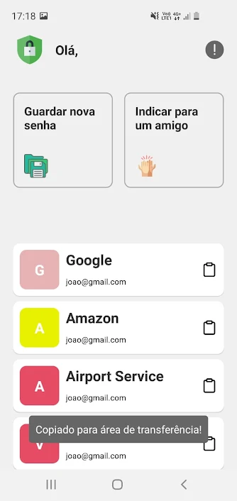

<div align="center">
  <div align="center">
    
  </div>

  <br>

  <p>
    
    &nbsp;
    
    &nbsp;
    
    &nbsp;
    
  </p>

  <br>

  > 🔐 Guarde suas senhas com segurança utilizando o PassFy de um jeito simples e sem rodeios
</div>


## 🚀 Como executar

Clone o projeto e acesse a pasta do mesmo.

```bash
$ git clone https://github.com/Azanniel/passfy.git
$ cd passfy
```

**🎯 Atenção: Para utilização de propagandas em modo de produção deve ser utilizado sua própria Ads ID tanto no app.json quanto no arquivo `src\adMobIDs\adUnitIdBanner.ts` e `src\adMobIDs\adUnitIdInterstitial.ts`**

Feito isso basta seguir os passos abaixo para executar o projeto:
```bash
# Instalar as dependências
$ yarn
# Iniciar o servidor node/expo do projeto
$ yarn start
```

Com o servidor node/expo rodando basta executar no emulador ou então escanear o QRCode com seu aplicativo **ExpoGo**


## 💻 Projeto

PassFy é uma aplicação que surgiu pela necessidade de guardar as senhas de forma fácil, rápida e sem muita burocracia.

A aplicação conta com multilinguagem (EN-US / PT-BR) e também com suporte a utilização da senha do próprio aparelho telefônico para lhe dar um nível de segurança ao acessar suas senhas salvas.

Caso tenha biometria o aparelho irá lhe solicitar nos próximos acessos depois de você já ter utilizado ele pela primeira vez.

Com esta aplicação você consegue cadastrar suas senhas de suas contas para poder copiar depois de um tempo ou quando precisar. Você também pode editar e excluir uma senha criada. Além disso, você pode indicar nossa aplicação para um amigo que também gostaria de lembrar mais vezes das senhas 😉.

Este foi um projeto bem simples 😅 feito durante um treinamento de React Native ministrado por mim na empresa ATX Tecnologia.

<br>

<p align="center">
  
  
  
</p>

## 👾 Coders

<table>
  <tr>
    <td align="center"><a href="https://www.linkedin.com/in/leandroazanniel/"><br /><sub><b>Leandro Azanniel</b></sub></a><br />💻</td>
    <td align="center"><a href="https://github.com/Matheus-Souza710"><br /><sub><b>Matheus Souza</b></sub></a><br />🎮</td>
    <td align="center"><a href="https://github.com/vitorA11"><br /><sub><b>Vitor Oliveira</b></sub></a><br />💡</td>
  </tr>
</table>

---

Rumo ao próximo nível 🚀 by Azanniel 👋🏻
